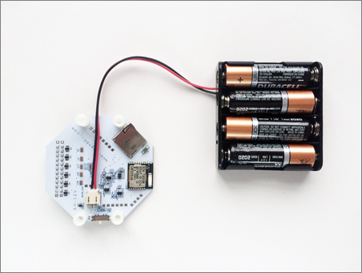
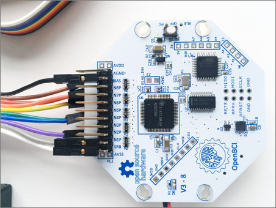

# Up & Running w/ the OpenBCI GUI

## 1. Download the Application

### a) Get the appropriate version for your OS

  

You should have:

 * OpenBCI 8-Bit Board w/Headers
 * Open BCI Programmable USB Dongle w/Headers
 * Touch Proof Electrode Adapter
 * 6V AA Battery Pack (Batteries Not Included)
 * 4 Plastic Feet for Board Stabilization

If you ordered an Open BCI Electrode Starter Kit, it should come with:

 * 10 passive, gold cup electrodes on a color-coded ribbon cable
 * 4oz Jar of Ten20 Conductive Electrode Paste

### 2. Hardware Setup

1. Attach the 4 plastic feet to your OpenBCI board
2. Buy 4 AA batteries and put them in your battery pack
3. Connnect the battery pack to the OpenBCI board
4. Connect your electrodes to the OpenBCI board: Black->BIAS; White->SRB; Gray->N1P
5. Connect the USB Dongle to your computer

### 3. Software Setup

1. Download Processing
2. Download GWOptics and ControlP5 Libraries
3. Unzip the libraries and put them in the /Processing/libraries/ folder.
4. Download the OpenBCI_Processing Github Repository:
`git clone https://github.com/OpenBCI/OpenBCI_Processing.git`

### 4. Headware Setup

1. Apply electrode paste to the 3 electrodes. Make sure to add enough paste so that it forms a convex shape on the electrode cavity, allowing for a strong seal with the skin.
2. Connect 1 ground electrode (typically to the mastoid behind the ear)
3. Connect 1 reference electrode to the earlobe
4. Connect 1 EEG channel electrode (any location on the head from where you want to sample EEG)

### 5. Test It

1. Open the file OpenBCI_GUI.pde in Processing and run the program.
2. Select your serial/COM port in the left hand menu and click Initialize System.
3. If for some reason, the brainwaves don't start streaming, switch your OpenBCI board to Off and then back to "PC", and redo the previous step.
4. Click into the main interface and press Tab to change to Channel settings.
5. De-select every channel but the one your EEG channel electrode is connected to, which will be Channel 1 if you connected it to the N1P pin.
6. If all goes as it should, you should see your brainwaves streaming out.
7. Play with the controls to get a feel for different ways to view the data.
8. Blink your eyes, grit your teeth, play around with it!