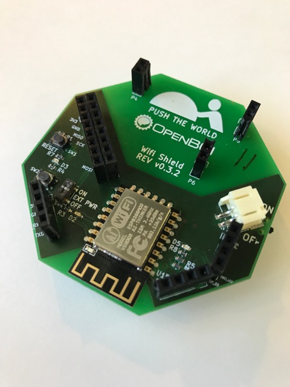

# Wifi Shield Programming Tutorial

##Overview
The OpenBCI Wifi Shield can be over the air programmed ([still working in progress :/ help needed](https://github.com/OpenBCI/OpenBCI_WIFI/issues/7)) or through a direct connection to the serial port on the wifi shield itself. For the wired programming, you can use the USB dongle that comes with the Cyton as a pass through or you can use a standard FTDI UART chip.

## Program OpenBCI Wifi with Arduino

**You will need:**

* Computer (Windows or Mac or Other)
* OpenBCI [Wifi Shield firmware](https://github.com/OpenBCI/OpenBCI_WIFI)
* [Arduino IDE Version 1.8.2](http://www.arduino.cc/en/main/software)
* Custom [ESP8266 libraries with SPISlave](https://github.com/esp8266/Arduino)

**Steps:**

1. Download and install the [Arduino IDE Version 1.8.2](http://www.arduino.cc/en/main/software).

   On Windows be sure to download the file marked `Windows Installer`.

   On Mac download the `MAC OS X` version, unzip the app and move it into Applications folder.

2. Follow the instructions for downloading the [Arduino ESP8266 core from Github](https://github.com/esp8266/Arduino#using-git-version). **DO NOT USE BOARDS MANAGER IN ARDUINO** because `SPISlave.h` is not part of the official version yet (coming in June with the 2.4.0 release).

## Program OpenBCI Wifi with make

While developing this firmware, we found it much better to use [makeESPArduino](https://github.com/plerup/makeEspArduino) which is a command line tool for building and compiling the firmware without having to use the Arduino IDE!

## Program Device Radio with FTDI Boards

There are many, many FTDI chip breakouts and cables out there that you can use. Here are a couple examples of popular devices.

### FTDI Friend

Another example would be the [FTDI Friend](http://www.adafruit.com/products/284) from Adafruit. I cut the trace on the RTS and 5V pads as well. These are the correct settings for uploading to ESP8266 using FTDI Friend. These breakouts are awesome and how the board was developed.

### FTDI Basic Breakout

Sparkfun makes an FTDI breakout as well, and they come in a couple of flavors. 5V and 3V. By now, you know that you want the [3V Version](https://www.sparkfun.com/products/9873). [pic coming soon] Also, if you have a version of this board with a voltage selection on the back, make sure that it has the 3.3V pads connected and the 5V pads cut!  

### OpenBCI Cyton Dongle

The OpenBCI Dongle can be used to upload firmware to ESP8266. See the section on how to [pass through the code](http://docs.openbci.com/Hardware/06-Cyton_Radios_Programming_Tutorial#cyton-radios-programming-tutorial-uploading-device-firmware-to-cyton-board-program-device-radio-with-openbci-dongle) in the radios section.

## Wired upload

### Getting the board in boot-loading mode

Wether you are using `makeESPArduino` or the Arduino IDE, the steps to get the board into boot-loading are as follows.

You can either unplug your Wifi Shield from the Cyton board.

Or keep the wifi shield attached and turn the external power off.

First, plug in battery to the wifi shield

Second power the Wifi shield

Then press and hold the `RESET` button.

Then press and hold the `PROG` button.

Release the `RESET` button

And finally release the `PROG` button

Now the board is ready to get hit with some new firmware!

Hook up the FTDI friend to the Wifi Shield, don't power the Wifi shield through the FTDI friend, it will not supply enough power!

|FTDI_Friend|Wifi Shield|
|-----------|-----------|
|GND|GND|
|RX|TX|
|TX|RX|

