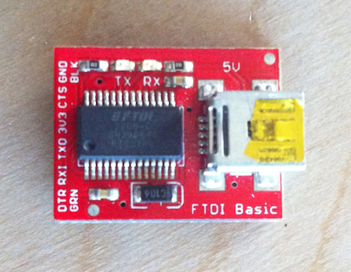
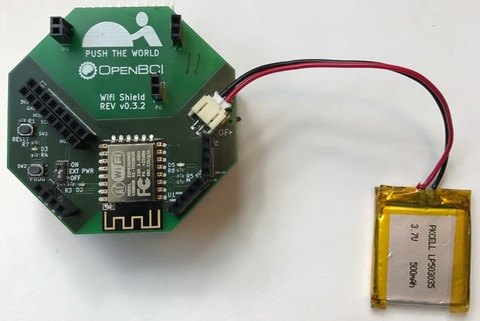

# Wifi Shield Programming Tutorial

**These documents are open source, if you see a typo [please open an issue](https://github.com/OpenBCI/Docs/issues/new).**

##Overview
The OpenBCI Wifi Shield can be programmed over the air or through a direct connection to the serial port on the wifi shield itself. Over the air is the preferred way to update your WiFi Shield. For the wired programming, you can use the USB dongle that comes with the Cyton as a pass through or you can use a standard [FTDI UART to USB Breakout board](http://docs.openbci.com/Hardware/12-Wifi_Programming_Tutorial#wifi-shield-programming-tutorial-program-openbci-wifi-with-ftdi-boards).

## Program OpenBCI WiFi Over The Air

**IMPORTANT: REMOVE THE WIFI SHIELD FROM CYTON OR GANGLION. KEEP BOARD ISOLATED DURING UPDATE**

Plug a battery into the WiFi Shield and power the Shield by turning the power switch to the `ON` position.

Download the latest stable released binary from the [Github page](https://github.com/OpenBCI/OpenBCI_WIFI/releases/latest). Save to downloads folder.

### Mac

Go to http://OpenBCI-2F0E.local/update where `2F0E` is your devices unique identifier. You may use the _windows_ ip based instructions too.

### Windows/Linux

Get the ip address of your wifi shield and visit http://192.168.0.1/update.

### Uploading The Firmware

**Be sure that the WiFi Shield is not physically connected to either a Ganglion or Cyton.** Use your `Spudger` tool to safely remove the WiFi Shield.

Select choose file and navigate to your Downloads folder where the recently downloaded hex file is, select the hex file and press ok. Then hit the `upload` button, the shield will accept the firmware and reboot.

## Wired upload

### Compile source code Program OpenBCI Wifi with Arduino

**You will need:**

* Computer (Windows or Mac or Other)
* OpenBCI [Wifi Shield firmware](https://github.com/OpenBCI/OpenBCI_WIFI)
* [Arduino IDE Version 1.8.3](http://www.arduino.cc/en/main/software)
* Custom [ESP8266 libraries with SPISlave](https://github.com/esp8266/Arduino)

**Steps:**

1. Download and install the [Arduino IDE Version 1.8.4](http://www.arduino.cc/en/main/software).

   On Windows be sure to download the file marked `Windows Installer`.

   On Mac download the `MAC OS X` version, unzip the app and move it into Applications folder.

2. Follow the instructions for downloading the [Arduino ESP8266 core from Boards Manager](https://github.com/esp8266/Arduino). **NOTE** because `SPISlave.h` is newly added to the official SDK, be sure to use 2.4.0 or newer!

3. Use the _Library Manager_ to search for and install: [OpenBCI_Wifi v1.1.3](https://github.com/OpenBCI/OpenBCI_WIFI) | [WifiManager v0.12.0](https://github.com/tzapu/WiFiManager) | [ArduinoJSON v5.11.1](https://bblanchon.github.io/ArduinoJson/) | [PubSubClient v2.6.0](https://pubsubclient.knolleary.net) | [Time v1.5.0](https://github.com/PaulStoffregen/Time) | [NtpClient 3.1.0](https://github.com/arduino-libraries/NTPClient)

4. From `Tools->Board` select `Adafruit Huzzah ESP8266` from the `ESP8266 Modules` subsection. Then from `Tools->Flash Size` select `4M (1M SPIFFS)`.

5. From `File->Examples->OpenBCI_Wifi` select `DefaultWifiShield`.

Now move down to

### Compile Source Code with make

While developing this firmware, we found it much better to use [makeESPArduino](https://github.com/plerup/makeEspArduino) which is a command line tool for building and compiling the firmware without having to use the Arduino IDE! Use the `makeESPWifiDefault.mk` file in the [WiFi's githuv repo](https://github.com/OpenBCI/OpenBCI_WIFI)

### Program OpenBCI Wifi with FTDI Boards

There are many, many FTDI chip breakouts and cables out there that you can use. Here are a couple examples of popular devices.

### FTDI Friend

Another example would be the [FTDI Friend](http://www.adafruit.com/products/284) from Adafruit. I cut the trace on the RTS and 5V pads as well. These are the correct settings for uploading to ESP8266 using FTDI Friend. These breakouts are awesome and how the board was developed.

### FTDI Basic Breakout

Sparkfun makes an FTDI breakout as well, and they come in a couple of flavors. 5V and 3V. By now, you know that you want the [3V Version](https://www.sparkfun.com/products/9873). [pic coming soon] Also, if you have a version of this board with a voltage selection on the back, make sure that it has the 3.3V pads connected and the 5V pads cut!  

### OpenBCI Cyton Dongle

The OpenBCI Dongle can be used to upload firmware to ESP8266. [See the section](http://docs.openbci.com/Hardware/06-Cyton_Radios_Programming_Tutorial#cyton-radios-programming-tutorial-uploading-device-firmware-to-cyton-board-upload-pass-thru-radio-firmware-version-2xx-fall-2016) on how to [pass through the code](http://docs.openbci.com/Hardware/06-Cyton_Radios_Programming_Tutorial#cyton-radios-programming-tutorial-uploading-device-firmware-to-cyton-board-program-device-radio-with-openbci-dongle) in the [Cyton Radio Programming Guide](http://docs.openbci.com/Hardware/06-Cyton_Radios_Programming_Tutorial).

## Put WiFi Shield in boot-loading mode

Whether you are using `makeESPArduino` or the Arduino IDE to compile your code, the steps to get the board into boot-loading are as follows:

Remove your Wifi Shield from the Cyton/Ganglion board. **Always use a spudger to remove your WiFi Shield from a Cyton or Ganglion.**

Plug in battery to the wifi shield

Second power the Wifi shield

Press and hold the `PROG` button.

Press and release the `RESET` button while holding `PROG`.

Finally release the `PROG` button

You should see no lights on the WiFi Shield if it is in boot-loading mode.

Hook up the FTDI friend, OpenBCI Dongle, or other UART-USB programmer to the Wifi Shield. **Don't power the Wifi shield through the FTDI friend.**

|FTDI_Friend|Wifi Shield|
|-----------|-----------|
|GND|GND|
|RX|TX|
|TX|RX|

Now press upload in the Arduino IDE or execute the `make -f makeESPDefault.mk flash` to upload to the shield.
