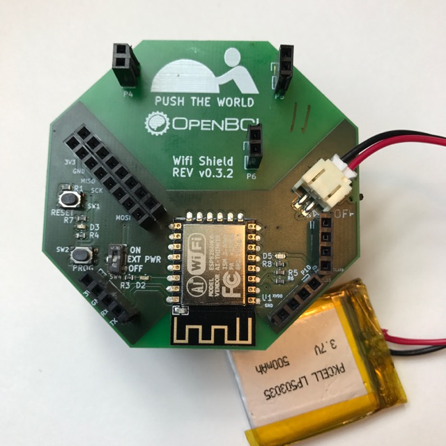

# OpenBCI Wifi Shield

**The Wifi shield and these docs are still in beta, if you see a typo [please open an issue](https://github.com/OpenBCI/Docs/issues/new).**

The OpenBCI Wifi Shield seeks to offer a plug and play Wifi solution for the OpenBCI Cyton and Ganglion.

One of the coolest parts is the restful fully qualified web server sitting on your OpenBCI board!

## Ganglion

### Prerequisites

1. OpenBCI Ganglion with at least [2.x.x firmware](https://github.com/OpenBCI/OpenBCI_Ganglion_Library/blob/development/OpenBCI_Ganglion_Library/examples/WifiGanglion/DefaultGanglion.ino)
2. Wifi shield with [current firmware](https://github.com/OpenBCI/OpenBCI_WIFI/blob/master/examples/ESP8266HuzzahSSDP/ESP8266HuzzahSSDP.ino)
3. Wireless local area network (internet)
4. Two batteries to power the whole system

### Powering the Wifi Shield

Wifi takes a lot more current to run then Bluetooth. The Wifi shield exceeds the maximum power of the Ganglion, so the Wifi shield has it's own power port that allows for much more current to flow. With the first hardware design of the Ganglion, we were not able to eliminate the need for two batteries. The ganglion runs at 3VDC while the wifi shield runs at 3.3VDC. They must share a common ground through!

Don't run power to the Ganglion through the top! Power running to the Ganglion with the `EXT PWR` in on `OFF` position.

Do NOT run Ganglion if because the `EXT PWR` is in `ON` position. We tested it in the lab and nothing bad will happen, it will just not work.

If the Ganglion is powered up already, the Wifi Shield can not start. The Ganglion will power on reset the Wifi sheld at the start of the ganglion initialization.

## Cyton

### Prerequisites

1. OpenBCI Cyton with at least [3.x.x firmware](https://github.com/OpenBCI/OpenBCI_32bit_Library/tree/dev-3.0.0)
2. Wifi shield with [current firmware](https://github.com/OpenBCI/OpenBCI_WIFI/blob/master/examples/ESP8266HuzzahSSDP/ESP8266HuzzahSSDP.ino)
3. Wireless local area network (internet)
4. Battery to power the whole system

### Powering the Wifi Shield

Wifi takes a lot more current to run then Bluetooth. The Wifi shield exceeds the maximum power of the Cyton, so the Wifi shield has it's own power port that allows for much more current to flow. To eliminate the need for two batteries, we pass through 3.3 VDC to the Cyton board, allowing you, the user, to only have to power the Wifi shield and never have to plug power directly into the Cyton again.

Power running to the Cyton with the `EXT PWR` in on `ON` position.

Power running to Wifi but NOT Cyton because the `EXT PWR` is in `OFF` position.

If the Cyton is powered up already, the Wifi Shield can not start. Don't power your Cyton and hot plug in a Wifi Shield.

## Parsing Data from Wifi Shield

Data can be sent from the Wifi shield in two different formats: `raw` and `JSON`.

### `raw` Byte Stream Format
The first byte to send is the control byte. For streaming data, that goes on the TCP socket, send `0xCX` (where `X` is `0-F` in hex) as the control byte. In the `OpenBCI_32bit_Library` code base:

~~~
/*  
 * @description Writes channel data and axisData array to serial port in
 *  the correct stream packet format.
 */
void OpenBCI_32bit_Library::sendChannelDataWifi(void)  {

    wifiStoreByte(OPENBCI_EOP_STND_ACCEL); // 0xC0 1 byte

    wifiStoreByte(sampleCounter); // 1 byte

    ADS_writeChannelDataWifi(); // 24 bytes

    accelWriteAxisDataWifi(); // 6 bytes

    wifiFlushBuffer(); // Flushes the buffer to the SPISlave ESP8266 device!

    sampleCounter++;

}
~~~  

This code writes 32 bytes of data in the correct format and therefore as soon as it arrives at the Wifi shield. The Wifi shield will convert the 32 byte packet to the standard 33 byte [binary format](http://docs.openbci.com/Hardware/03-Cyton_Data_Format#cyton-data-format-binary-format) by moving the control byte `0xCn`, where `n` is `0-F` (hex), to the stop position and add add `0xA0` to the start position. This allows for a seamless integration with the tried and tested parsing systems already built for the Cyton.
**Important** if you want to only send `20` bytes of data per packet, you still must send this `32` bytes with the proper start and stop bytes.
