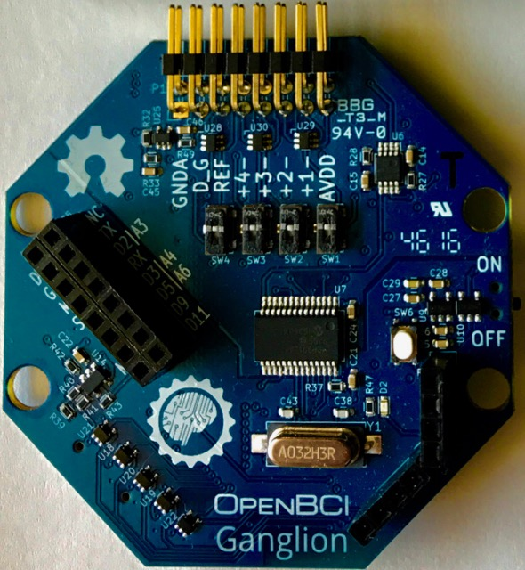
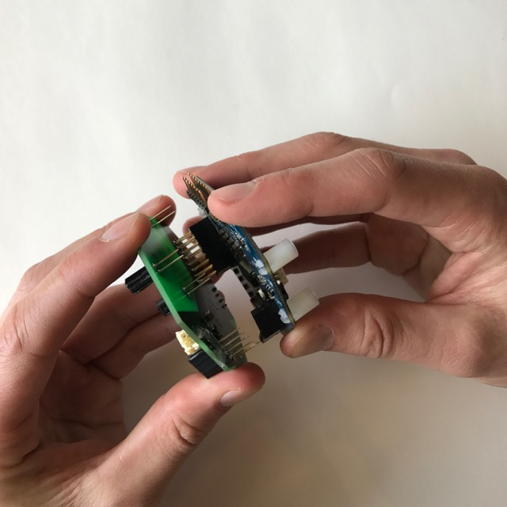
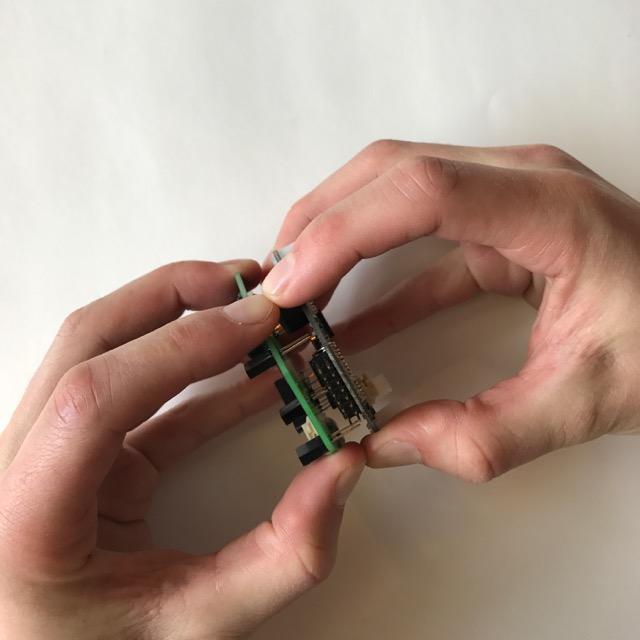
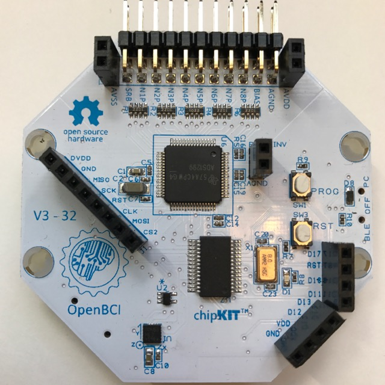
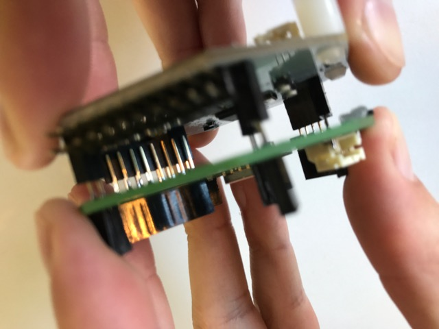

# Wifi Getting Started Guide

**The Wifi shield and these docs are still in beta, if you see a typo [please open an issue](https://github.com/OpenBCI/Docs/issues/new).**

##Overview

This guide will walk you through setting up your Wifi Shield, connecting it to your computer, and then connecting it to yourself. The first tutorial is for the Cyton and the second if for Ganglion. Please review this guide in its entirety before starting. Have fun!

# Ganglion
## What You Need

 1. OpenBCI Wifi Shield
 2. OpenBCI Ganglion Board
 3. 2x LiPo battery or 6V AA battery pack & (x4) AA batteries (batteries not included)
 4. A computer connected to the internet

### 1. OpenBCI Wifi Shield

The battery connector on the back can accept 3V to 6V DC power input. The pushbutton is a reset button. For more information on the Wifi Hardware, visit the [OpenBCI Wifi](http://docs.openbci.com/Hardware/11-Wifi) page in the Hardware section. To update the shield to the latest firmware please visit the [OpenBCI Wifi Programming Tutorial](http://docs.openbci.com/Hardware/11-Wifi_Programming_Tutorial) also in the Hardware section.

### 2. OpenBCI Ganglion Board

Please be sure to have at least v2.x.x Ganglion firmware running on your board! If you have firmware v1.0.0 please see the [programming tutorial](http://docs.openbci.com/Hardware/09-Ganglion_Programming_Tutorial) to learn how to upgrade your firmware.

### 3. 2x  6V AA Battery Pack & 4 AA Batteries or LiPo Battery

Install 4 AA batteries in your battery pack or charge up that LiPo battery. The Wifi shield has a 4-5x larger power draw then the Bluetooth communication system so we recommend using LiPo to save! As of today, the Wifi shield cannot pass through power to the Ganglion. **Keep external `EXT PWR` to `OFF` when using Ganglion**

## Seating the Wifi Shield

Remove power to your Ganglion and Wifi shield.

First line up the big header.

Then line up the two four pin headers.

Finally once all the pins are lined up, you can press straight down to fully seat the wifi shield onto it's new Ganglion home :)

## Removing the Wifi Shield

Remove power to your Ganglion and/or Wifi shield.

Wiggle the board slowly off

Or pull the shield straight off to avoid bending the pins.

## Powering the Shield

Your Ganglion cannot be powered from the wifi shield. You will need two batteries. Always turn the Wifi on before the Ganglion.

The pass through LED on the wifi shield will show the classic _pleasant_ blue LED when powered up!

Make sure that the external power switch is set to `OFF` to **NOT** power through to the Ganglion board.

The Ganglion is not able to supply enough current to power the power-hungry wifi shield, so we put a bigger voltage regulator on the shield. In the future, the wifi shield will be able to power the Ganglion too.

# Cyton
## What You Need

 1. OpenBCI Wifi Shield
 2. OpenBCI Cyton Board
 3. LiPo battery or 6V AA battery pack & (x4) AA batteries (batteries not included)
 4. A computer connected to the internet

### 1. OpenBCI Wifi Shield

The battery connector on the back can accept 3V to 6V DC power input. The pushbutton is a reset button. For more information on the Wifi Hardware, visit the [OpenBCI Wifi](http://docs.openbci.com/Hardware/11-Wifi) page in the Hardware section. To update the shield to the latest firmware please visit the [OpenBCI Wifi Programming Tutorial](http://docs.openbci.com/Hardware/11-Wifi_Programming_Tutorial) also in the Hardware section.

### 2. OpenBCI Cyton Board

Please be sure to have at least v3.x.x Cyton firmware running on your board! If you have firmware v1.0.0 please see the [Upgrade Guide](https://github.com/OpenBCI/OpenBCI_32bit_Library/blob/dev-3.0.0/UPGRADE_GUIDE.md) because you need to upgrade your [bluetooth radio firmware](https://github.com/OpenBCI/OpenBCI_Radios) because the new 3.0.0 code runs of the stability introduced in 2.0.0.

### 3. Your 6V AA Battery Pack & 4 AA Batteries or LiPo Battery

Install 4 AA batteries in your battery pack or charge up that LiPo battery. The Wifi shield has a 4-5x larger power draw then the Bluetooth communication system so we recommend using LiPo to save!

## Seating the Wifi Shield

Remove power to your Cyton and/or Wifi shield.

First line up the big header.

Then line up the front analog pins.

Finally once all the pins are lined up, you can press straight down to fully seat the wifi shield onto it's new Cyton home :)

## Removing the Wifi Shield

Remove power to your Cyton and/or Wifi shield.

Either wiggle the board slowly off

Slowly...

Or pull the shield straight off to avoid bending the pins.

## Powering the Shield

From here on out you will power your Wifi Shield and the Cyton board using only one battery by means of the JST connector on the wifi shield.

The pass through LED on the wifi shield will show the classic _pleasant_ blue LED when powered up!

Make sure that the external power switch is set to `ON` to send power through to the Cyton board.

The Cyton is not able to supply enough current to power the power-hungry wifi shield, so we put a bigger voltage regulator on the shield to power both the Wifi chip and pass the Cyton components.
