# OpenBCI Hardware Documentation
## OpenBCI 8bit Board

###8bit Board Specs:

 * Power with 6-12V DC Battery ONLY
 * ATmega328P Micrcontroller with Arduino UNO bootloader
 * ADS1299 Analog Front End 
 * LIS3DH 3 axis Accelerometer 
 * RFduino BLE radio 
 * Micro SD card slot
 * Voltage Regulation (5V, 3V, +2.5V, -2.5V)
 * SN74LVCC3245A Level Shifter
 * Board Dimensions 2.41" x 2.41" (octogon has 1" edges)
 * Mount holes are 1/16" ID, 0.8" x 2.166" on center
 

###Breakout pins:
 
 * ICSP pins on 5V side for bootloading ATmega 
 	* MISO, MOSI, SCLK, 5V, MCLR, GND
 * Serial pins for programming RFduino
 	* RFTX, RFRX, RFRST, GND
 * SPI bus pins on the 3V side for Daisy Module expansion
 	* DVDD, GND, MISO, MOSI, SCK, CS, CLK, RST
 * Unused ATmega pins
 	* A0, A1, A2, A3, A4, A5, A6, A7
 	
The SPI bus pins on 3V side include CLK, which is tied to the ADS1299 CLK pin for timing the Daisy Module, and a RST pin which is tied to the ADS1299 MCLR pin for hardware reset of the ADS. The A0 to A5 pins can be used as Analog inputs or Digital Input|Output just like on Arduino UNO. A6 and A7 are Analog input only.

###Push Button
Pushbutton switch is RESET for ATmega. 

###Slide Switch
Slide switch is power for the board. The slide switch has three positions:

* BLE activates a pull-up on RFduino pin 4
* OFF disconnects the battery input 
* PC does NOT activate pull-up on RFduino pin 4

    **NOTE: BLE|PC selection is NOT implememnted!**

Swtiching either BLE or PC will produce the same result. The option is available for future development... 

### OpenBCI 8bit Board Circuit Schematic

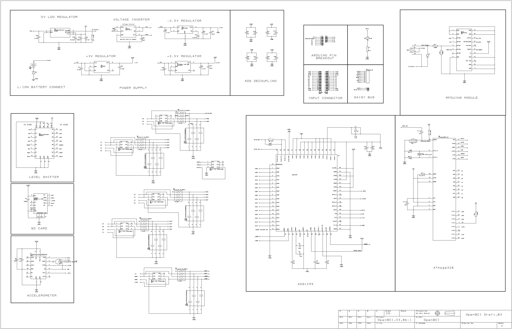

### 8bit Board PCB Layer Images

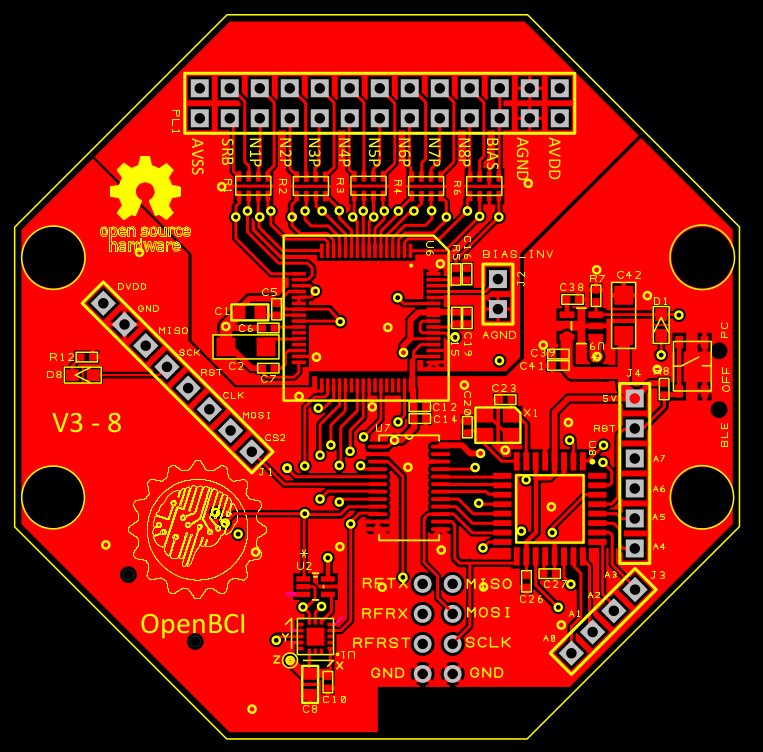
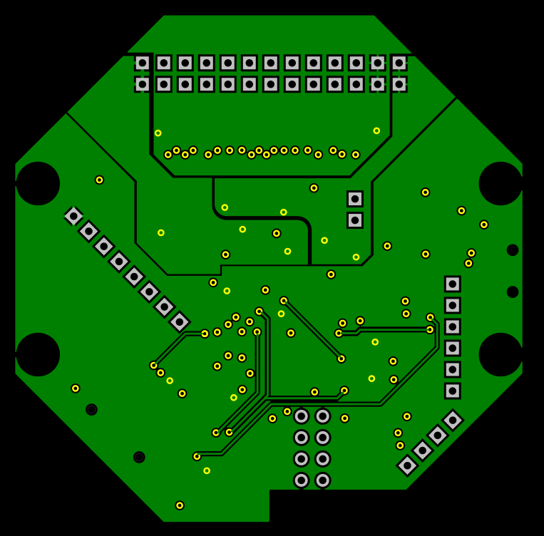
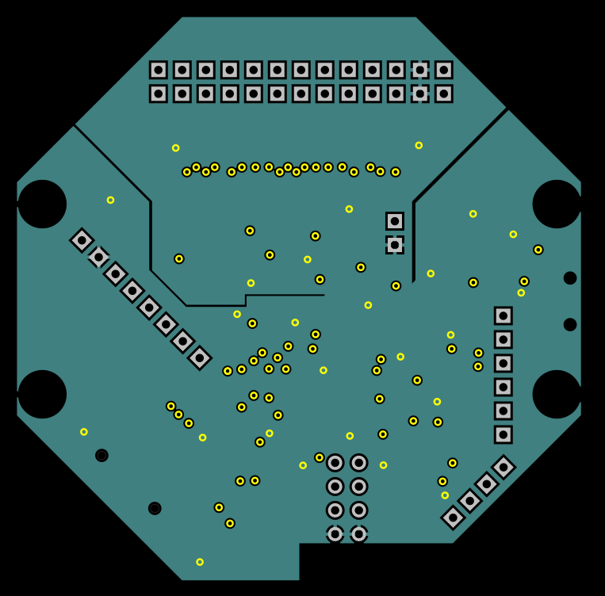

### 8bit Board PCB Files
[OpenBCI 8bit gerber & BOM (568K zip)](http://ultracortex.com/downloads/hardware/OpenBCI_8bit.zip)

## OpenBCI 32bit Board

###32bit Board Specs:

 * Power with 3-6V DC Battery ONLY
 * PIC32MX250F128B Micrcontroller with chipKIT UDB32-MX2-DIP bootloader
 * ADS1299 Analog Front End 
 * LIS3DH 3 axis Accelerometer 
 * RFduino BLE radio 
 * Micro SD card slot
 * Voltage Regulation (3V3, +2.5V, -2.5V)
 * Board Dimensions 2.41" x 2.41" (octogon has 1" edges)
 * Mount holes are 1/16" ID, 0.8" x 2.166" on center
 
###Breakout pins:
 
 * Program pins for bootloading PIC 
 	* PGC, PGD, VDD, MCLR, GND
 * Serial pins for programming RFduino
 	* RFTX, RFRX, RFRST, GND
 * SPI bus pins on the 3V side for Daisy Module expansion
 	* DVDD, GND, MISO, MOSI, SCK, CS, CLK, RST
 * Unused PIC32 pins
 	* D11, D12, D13, D17, D18
 	
The SPI bus pins on 3V side include CLK, which is tied to the ADS1299 CLK pin for timing the Daisy Module, and a RST pin which is tied to the ADS1299 MCLR pin for hardware reset of the ADS chips. We use a PICkit 3 to bootload the PIC chips. Pins D11, D12, and D13 can be analog or digital. D11 is also PGD, and has the blue LED in series with a 1K resistor connected to AGND. D12 is PGC, for bootloading purposes. D17 and D18 are digital I|O only. D17 is connected to the PROG pushbutton. The PROG button can be used as an input by setting it's MODE and doing digitalRead on it (there is a 470K pulldown on D17, pressign PROG pulls the pin up to DVDD).

###Push Buttons
The RST pushbutton is connected to MCLR on the PIC. Pressing it will reset the PIC. To put the PIC into bootloader mode so that it can be re-programmed, press the RST button and hold it down. Then press the PROG button. Then release the RST button, and the blue LED will blink pleasantly, announcing that the PIC is ready to accept new code.

###Slide Switch
Slide switch is power for the board. The slide switch has three positions:

* BLE activates a pull-up on RFduino pin 4
* OFF disconnects the battery input 
* PC does NOT activate pull-up on RFduino pin 4

    **NOTE: BLE|PC selection is NOT implememnted!**

Swtiching either BLE or PC will produce the same result. The option is available for future development... 

### OpenBCI 32bit Board Circuit Schematic

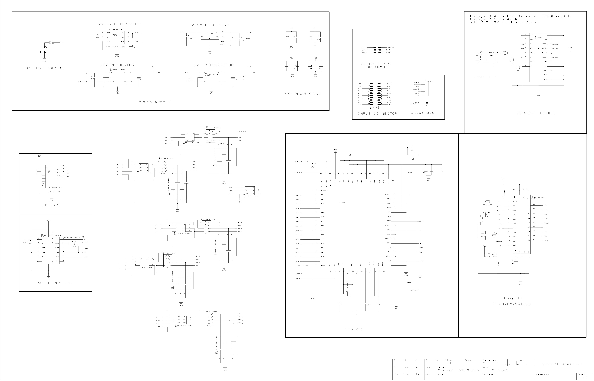

### 32 bit Board PCB Layer Images

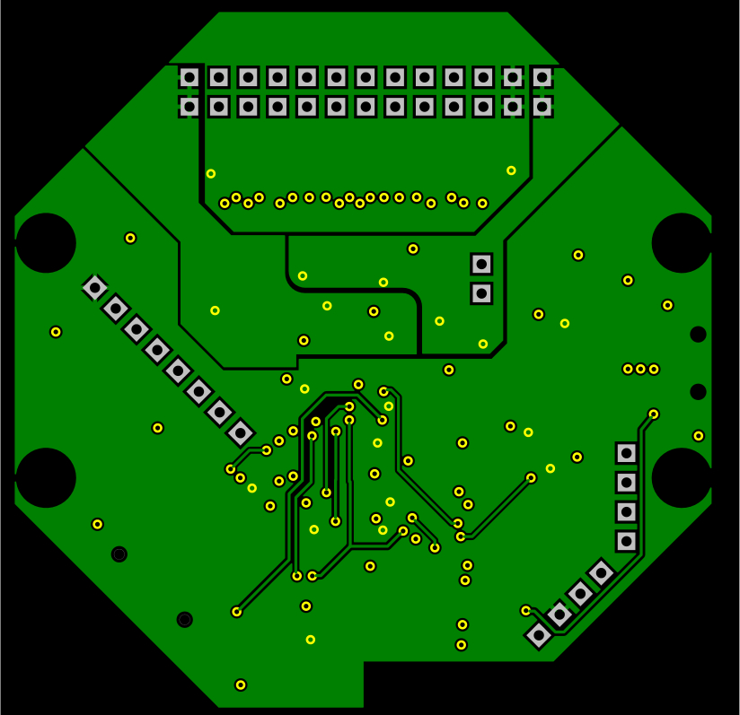
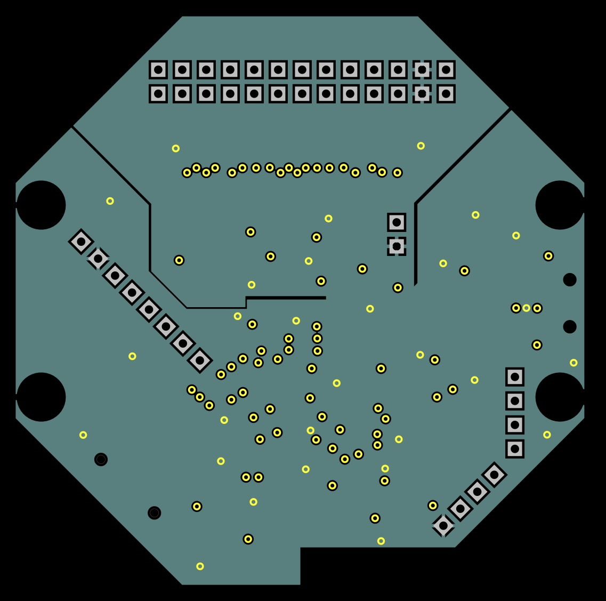
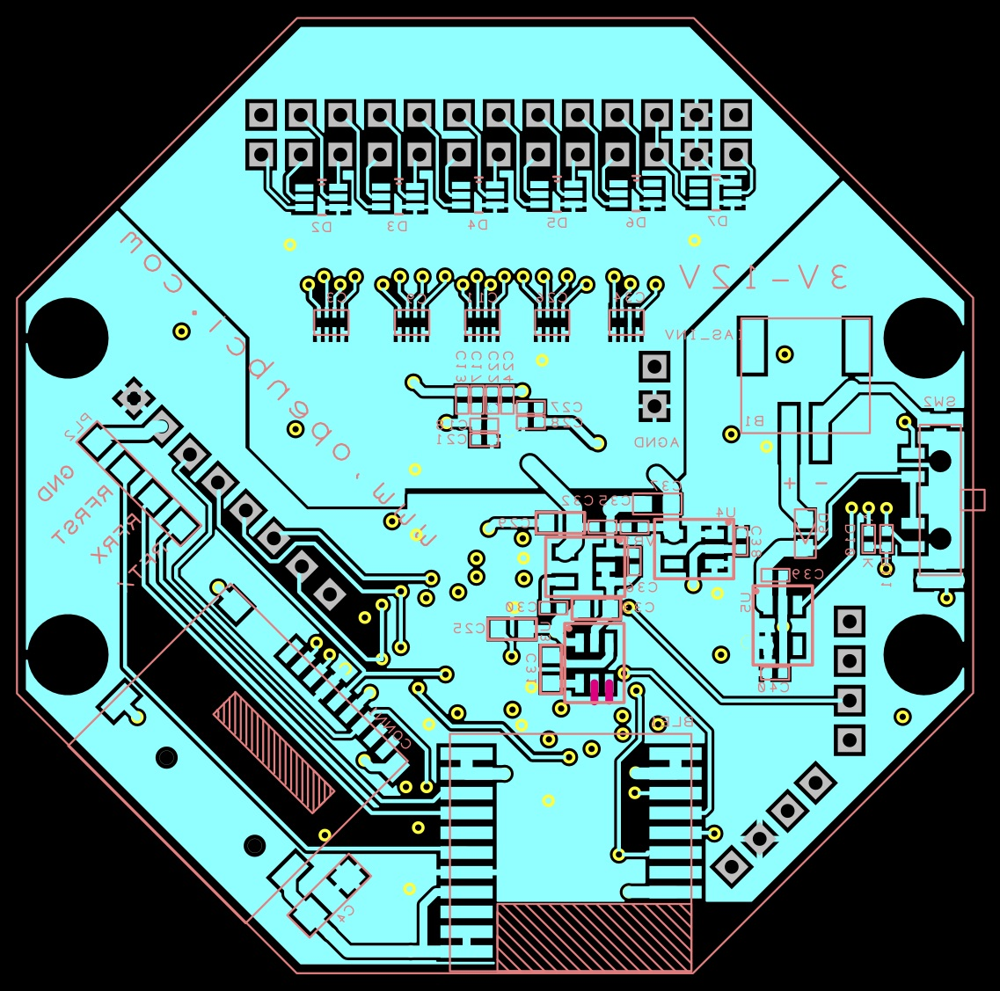

### 32bit Board PCB Files
[OpenBCI 32bit gerber & BOM (567K zip)](http://ultracortex.com/downloads/hardware/OpenBCI_32bit.zip)

##OpenBCI DONGLE

###Dongle Specs

* Power via USB connector ONLY
* RFduino BLE radio module
* FTDI USB<>Serial IC (FT231XQ-R)
* Resettable fuse

###Breakout Pins
RFduio pins are broken out in the same order and layout as the RFduino radio and shields. The TXD (red) and RXD (greed) LEDs are connected to outputs from the FTDI chip. The blue LED is connected to RFduino GPIO2.
###Slide Switch
The slide switch on the Dongle has two positions (noted on the bottom silkscreen). When the switch is on the GPIO6 side, the FTDI DTR pin is routed to RFduino pin 6 and ready to pass data to-from the OpenBCI board. This configuration is 'normal' mode, and also allows for programming the OpenBCI board over air. When the switch is on the RESET side, the FTDI DTR pin is routed to the RFduino RESET pin. This mode allows for re-programming the RFduino on the Dongle. 
### OpenBCI Dongle Circuit Schematic

### Dongle PCB Layer Images

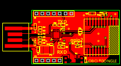
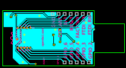

### Dongle PCB Files
[OpenBCI Dongle gerber & BOM (518K zip)](http://ultracortex.com/downloads/hardware/OpenBCI_Dongle.zip)

##OpenBCI Daisy Module
###Daisy Module Specs:

  
 * Power via pass-thru from OpenBCI Board pins ONLY
 * ADS1299 Analog Front End 

###Breakout pins:
 
 * SPI bus pins for communication with OpenBCI Board
 	* DVDD, GND, MISO, MOSI, SCK, CS, CLK, RST
 * Analog Power and BIAS pins
 	* AVDD, AVSS, AGND, BIAS
 	
The OpenBCI Daisy Module should be used as an expansion card for the OpenBCI Board ONLY. Daisy Modyle requires an external clock signal (2.048MHz) to be applied to the CLK pin.
###OpenBCI Daisy Module Circuit Schematic
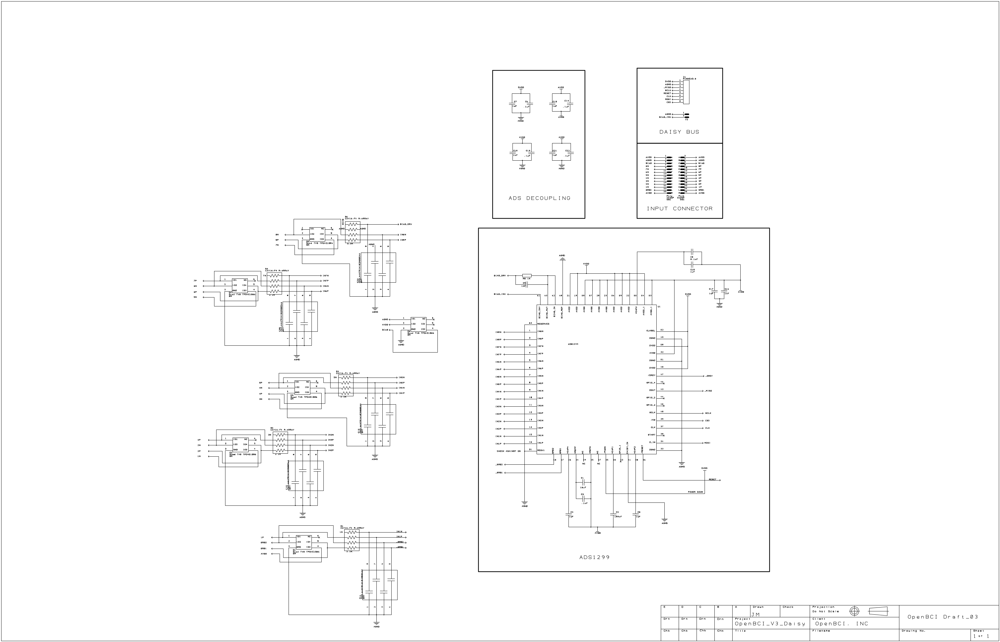
###Daisy Module PCB Layer Images
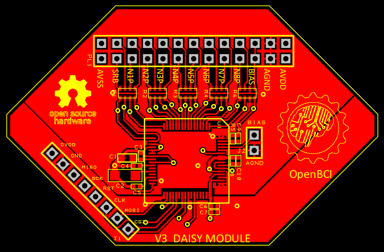
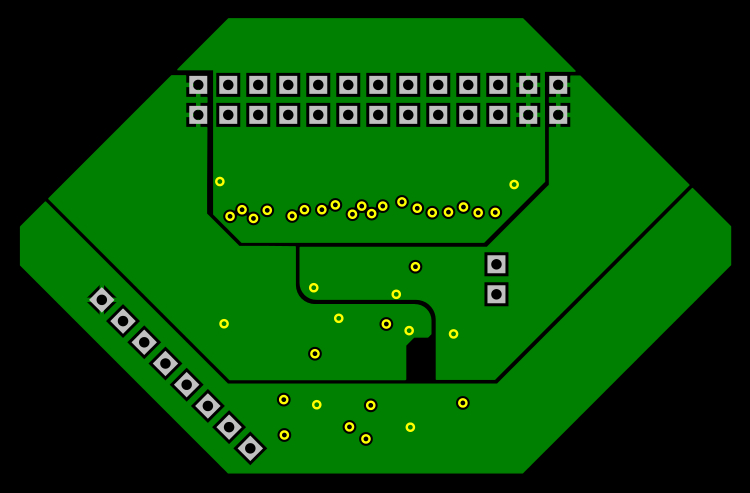
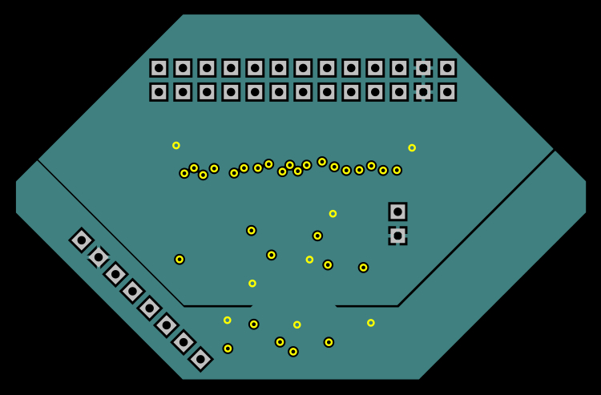
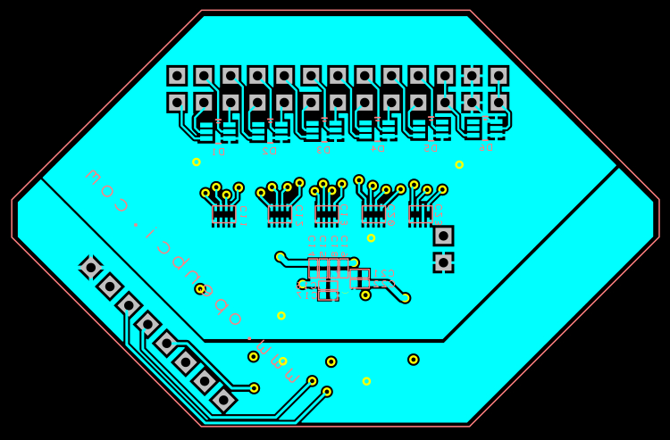
###Daisy Module PCB Files
[OpenBCI Daisy Module gerber & BOM (532K zip)](http://ultracortex.com/downloads/hardware/OpenBCI_DaisyModule.zip)
