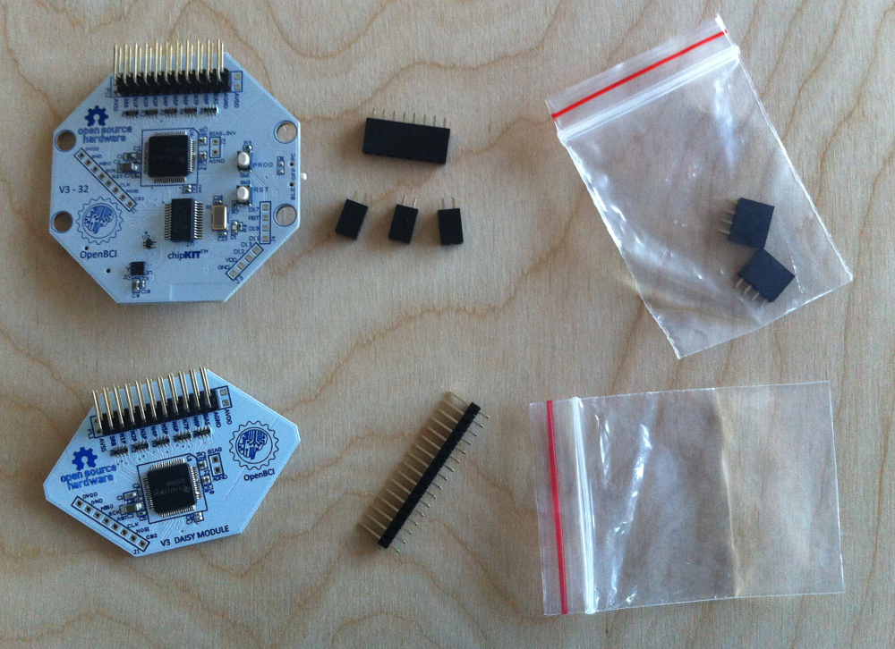
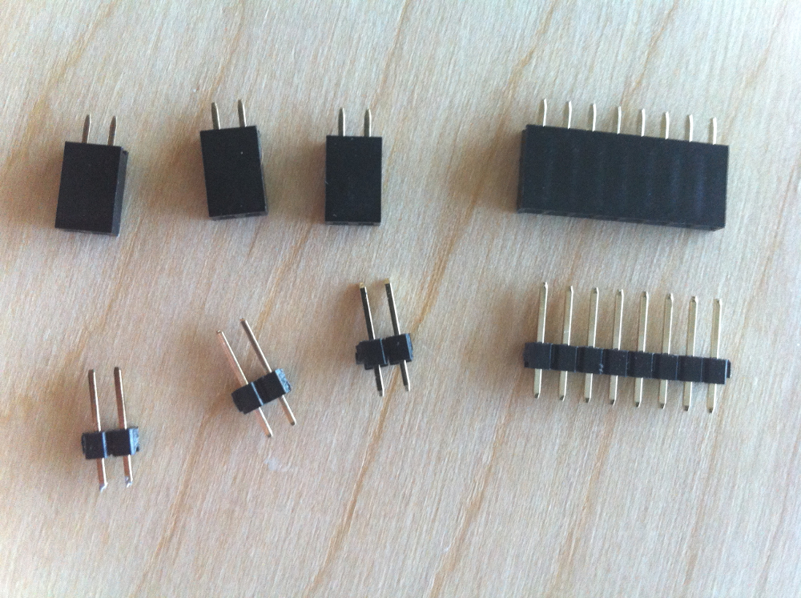
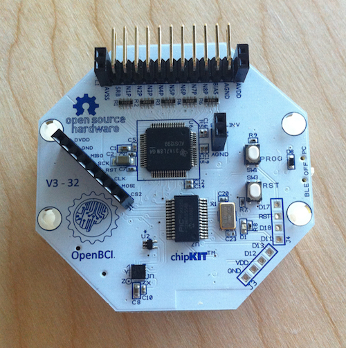
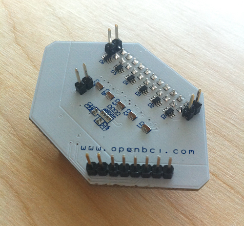
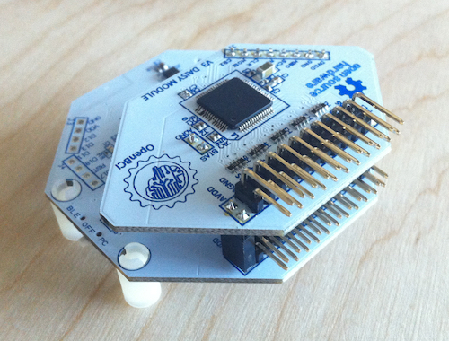

#OpenBCI Daisy Module Assembly
##Overview
The OpenBCI Daisy Module is an expansion card for the OpenBCI system that adds 8 more channels for a total of 16 ADS1299 inputs. The ADS1299 provides for a few different methods for interfacing multiple ICs. OpenBCI 16 channel system is designed for maximum flexibiltiy. The Daisy Module gets power and control signals from the OpenBCI main board. At this point, only the OpenBCI 32bit board firmware supports 16channels. Power is shared via the following pins:

* DVDD (3.3V)
* GND (0V)
* AVSS (-2.5V)
* AVDD (+2.5V)
* AGND (0V) 

 
The ADS1299 ICs communicate over an SPI bus, so the Daisy Module has these digital pins available:

* SCK - SPI clock pin
* MOSI - SPI Master Out Slave In
* MISO - SPI Master In Slave Out
* RST - ADS1299 hardware reset
* CLK - ADS1299 Master Clock signal generated by and sent from Board mounted ADS
* SC2 - SPI Chip Select pin for the Daisy Module mounted ADS
	
There is also a connection betwee the boards called BIAS, which routes Daisy Module signals to the main Board for proper Bias generation. Another term for Bias is Right Leg Drive (RLD), and in our case the Bias is created by internally to the ADS and includes inverted channel signals at the user's discretion. 
	
	
Before you get up and running, you will need to solder some header pins to your 32bit Board and Daisy Module. Let's do it!

##Attaching Headers

For this assembly, we will need:

* OpenBCI 32bit Board
* 2 position female headers (3 pieces)
* 8 position female header (1 piece)
* OpenBCI Daisy Module
* 16 position male header (1 piece)

Save the two 4 position female headers for mounting to the unused PIC chip pins broken out on the lower right of the 32bit board.

Break the male header row into three 2 position and one 8 position segments. 

Solder the 8 position female row to the diagonal pin row on the left of the 32bit board, And the three 2 position headers solder to AVSS, AVDD, and the BIAS/AGND holes. 

Next, sloder the male header pins on the un-populated holes in the Daisy Module as shown. Make sure that you solder the **top** of the board, and that the pins come out of the **bottom** for connection to the 32bit board. 

The 32bit boards shipped as a part of the 16 Channel R&D Kit are already loaded with firmware that interfaces with the Daisy Module. On start-up and initialization, the 32bit Board will 'smell' for the Daisy. 
