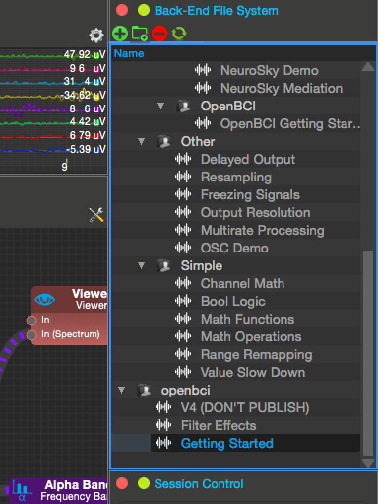
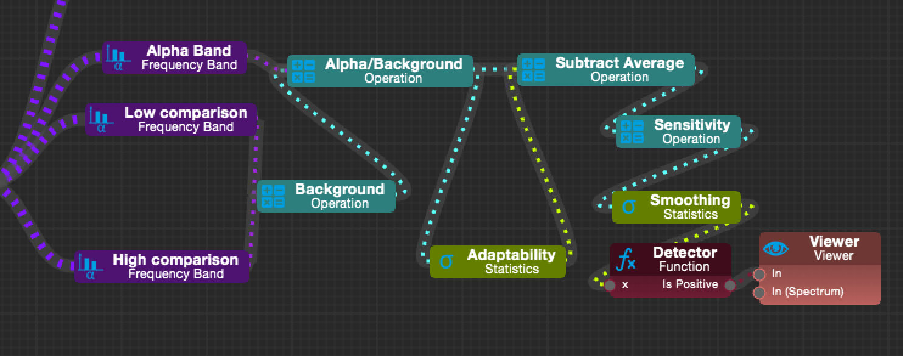

# Neuromore

## Installation

**Windows**: Follow [OBCI on Windows](http://docs.openbci.com/tutorials/10-OpenBCI_on_Windows) tutorial to properly connect your OBCI board on Windows. Then, continue this tutorial.

**OS X**: See the [FTDI OS X fix](http://docs.openbci.com/tutorials/09-Mac_FTDI_Driver_Fix) first, then follow these instructions.

**Linux**: Neuromore doesn not yet support linux platforms but plans to in the near future.

### I. Neuromore Software
Download the latest Neuromore software from their [website](http://www.neuromore.com/). Their main software is the Neuromore Studio which they plan to keep inproving on and keep free!

### II. Connect the Board

**Windows**: Connect your OBCI board and make sure it is recognized as a COM port and it's latency is set to 1 ms. To troubleshoot, read [this](http://docs.openbci.com/tutorials/10-OpenBCI_on_Windows).

**OS X**: Make sure your board is connected and visible as a device. To check you can type `ls /dev/tty.*` on your terminal. An example connected OBCI board should like like this:

	Rodrigos-MacBook-Pro:~ rodrigo$ ls /dev/tty.*
			/dev/tty.OpenBCI-DN00959R

### III. Connect to Neuromore

Neuromore is pretty awesome in terms of board connectivity. If you open up the studio and connect your board, 9 out of 10 times it'll automatically connect. 

If it doesn't, try the following:

1. Reset OBCI Board (Press Reset Button). 
2. Turn OBCI Board OFF, disconnect dongle, reconnect dongle, turn board back ON. 
3. Close Neuromore and disconnect board and dongle. Connect Dongle and Board again and then open Neuromore Studio.

NOTE: If your board is connected properly, Neuromore should have no trouble connecting to it.

## Getting Started

### Location

A good way to get started with Neuromore and the whole concept of classifiers is to look at the Getting Started OBCI example. 

This example can be found in the Back-End File System display which has all sorts of useful classifiers and other examples. 

### Clasifiers
Neuromore calls these graphs of interconnected processing units, "Classifiers".

The basic structure of a classifer consists of a input device (such as OpenBCI V3) connected to processing nodes that end in some sort of output node. 

This sort of graphical programming (or [visual programming](https://en.wikipedia.org/wiki/Visual_programming_language)) also appears in very popular programs like [PureData](https://puredata.info/) and [MAX]( https://en.wikipedia.org/wiki/Max_(software) ) for more general puroses and [OpenViBE](http://docs.openbci.com/research%20tools/OpenViBE) and of course Neuromore for EEG specific processing. 

The basic idea is that a stream of data that originates at the input device can then be mapped, processed and transformed into outputs that are useful, informative or just plain cool.

The getting started example for OpenBCI in the Neuromore Studio explores these areas and how to properly use the graphical programming interface. 

The best example within the classifier is perhaps the dynamic alpha detector.

This alpha detector maintains a 30 sec average of the ratio between the alpha (8-12 Hz) and the background signal intensity. The detector itself reports an alpha reward that is dynamically changed by the average alpha/background ratio. This system is adaptive to lower or high alpha environments and makes alpha rewards harder when the average alpha ratio is high and vice-versa.

By changing the "sensibility" parameter node you can then manually tune the relative "difficulty" that is necesary to attain an alpha detection. 

This system is flexible to different electrodes and electrode placement as it adjusts dynamically its expectations of what alpha "looks like".

From this example we can see the power of statistics and simple logic that can easily be incorporated through visual programming into a complex and robust system. 

## Other resources

- [Neuromore.com](http://www.neuromore.com/)
- [Video tutorials](https://www.youtube.com/channel/UCAOU6SsvwCwC30hJaFLhWgw)
- [Grahical Programming](http://c2.com/cgi/wiki?GraphicalProgrammingLanguage)

