
# Getting Started w/ OpenBCI

## I. What You Need

 1. OpenBCI board
 2. OpenBCI Dongle
 3. OpenBCI Electrode Starter Kit (ESK) or your own electrodes
 4. 6V AA battery pack & (x4) AA batteries (batteries not included)
 5. (x4) plastic feet for board stabilization

### 1. Your Board

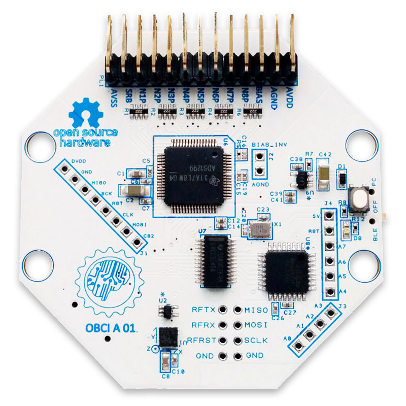

This tutorial can be followed if you are working with any OpenBCI board (8bit, 32bit, or 32bit with Daisy). I'll be working with the 8bit board.

### 2. Your OpenBCI USB Dongle

The OpenBCI USB Dongle has an integrated RFDuino that communicates with the RFDuino on the OpenBCI board. The dongle establishes a serial (if you're working on a MAC) or COM (if you're on PC or Linux) connection with your computer with its on-board FTDI chip. You'll be connecting to this serial port from the OpenBCI GUI or whatever other software you want to end up using to interface your OpenBCI board.

### 3. Your Electrode Starter Kit (ESK) Or Other Electrodes

If you ordered an Open BCI Electrode Starter Kit, it should come with:

 * 10 passive, gold cup electrodes on a color-coded ribbon cable
 * 4oz Jar of Ten20 conductive electrode paste
 

 
If you plan to work with your own electrodes, the touch-proof adapter may come in handy. It will convert any electrode that terminates in the industry-standard touch-proof design to an electrode that can be plugged into OpenBCI!

### 4. Your 6V AA Battery Pack & 4 AA Batteries

Both the 8bit board and the 32 bit boards have specific input voltage ranges. These input voltage ranges can be found on the back-side of the board, next to the power supply. **BE VERY CAREFUL** to not supply your board with voltages above these ranges, or else you will damage your board's power supply. For this reason, we recommend that you always use the battery pack that came with your OpenBCI kit.

### 5. (x4) Plastic Feet

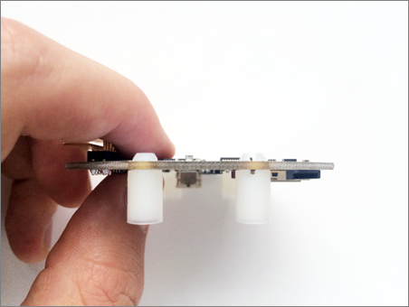

Your OpenBCI kit comes with 4 plastic feet that can be snapped into the wholes of your board to provide extra stability while working.

## II. Download & Install the OpenBCI GUI

### 1. Download the OpenBCI GUI App

From the links below or from our [downloads page], get the latest version of the OpenBCI GUI]. There are versions for [Mac OS X](http://ultracortex.com/downloads/application.macosx.zip), [Win32](http://ultracortex.com/downloads/application.windows32.zip), [Win64](http://ultracortex.com/downloads/application.windows64.zip), [Linux32](http://ultracortex.com/downloads/application.linux32.zip), and [Linux64](http://ultracortex.com/downloads/application.linux64.zip). If you’re having issues installing or launching the app, check out (or start) the [Forum section](http://openbci.com/index.php/forum#/categories/software) on this.

### 2. Or run it from Processing (for developers)

You can also launch the application (and check out all of the code that makes it work) from the [Processing IDE](https://processing.org/). Processing is a very powerful Java-based creative coding framework with lots of great graphics libraries. The latest version of the code is always kept in our [OpenBCI_Processing](https://github.com/OpenBCI/OpenBCI_Processing) Github repo. You can also check out other branches of the code, where we’ll be trying out new features. For more information on working with the Processing code, check out the [Up & Running w/ The OpenBCI GUI](http://docs.openbci.com/03-OpenBCI_GUI) docs page.

### 3. Launch the OpenBCI GUI

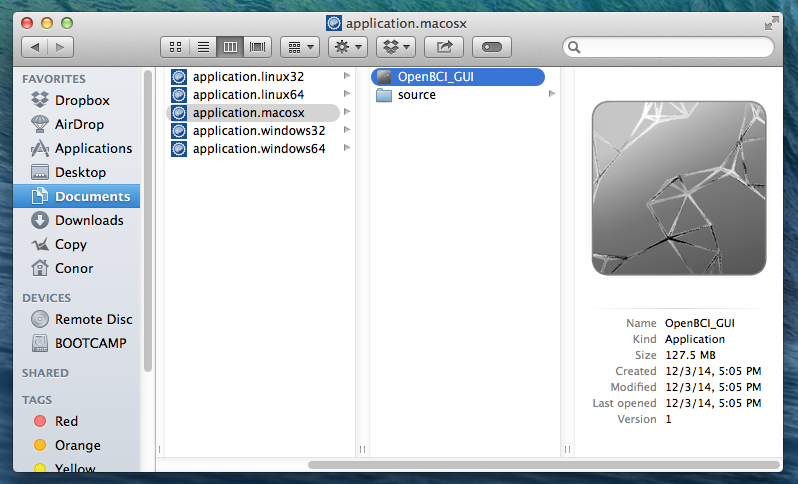

a. Double-click the **OpenBCI_GUI app** icon (or run the .exe file if you're on Windows) and the GUI should launch without any issues. If you're encountering an error here, please refer to the [Forum section](http://openbci.com/index.php/forum#/categories/software) on this.

b. Once the GUI is running, select "SYNTHETIC (algorithmic)" and hit the "START SYSTEM" button to launch the GUI with a synthetic data generator.

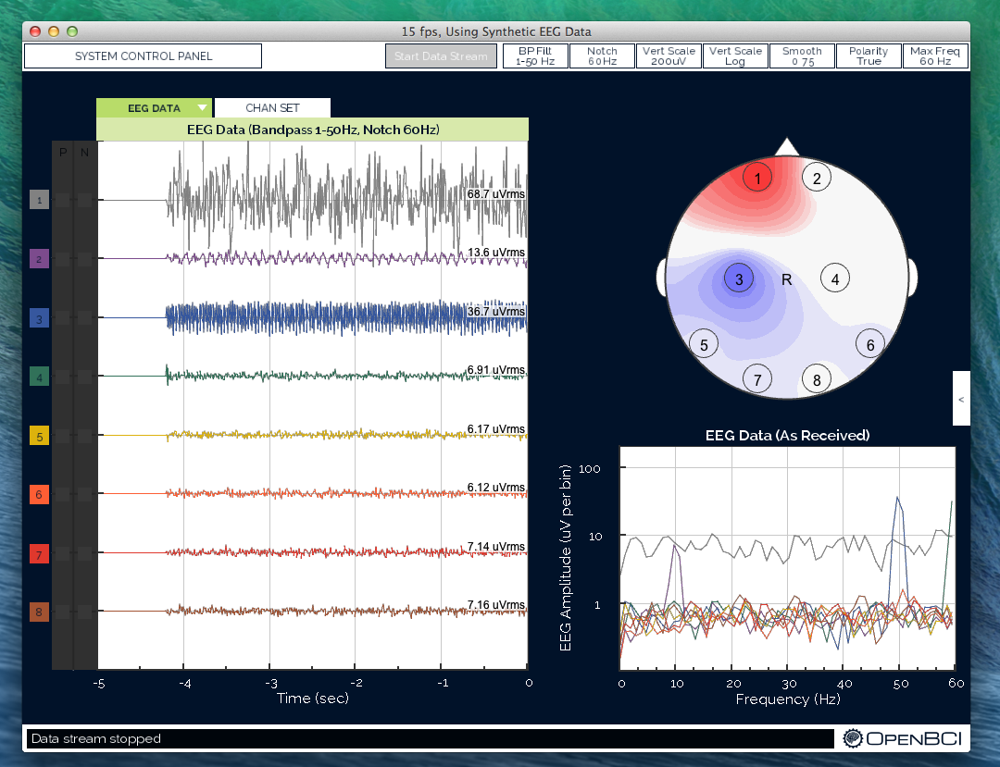

c. Click the dark overlay on the GUI to exit the SYSTEM CONTROL PANEL and then hit the "Start Data Stream" button to begin the stream of synthetically generated EEG data. You should then see data streaming across the "EEG Data" graph on the left side of the GUI. 

## III. Prepare your OpenBCI Hardware

### 1. Make sure your FTDI drivers are installed and up-to-date

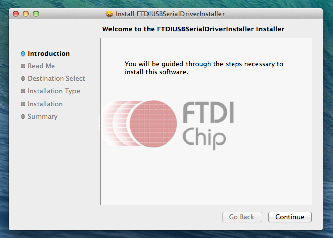

The FTDI chip on your OpenBCI Dongle requires you to install the FTDI drivers on your machine. You may already have these installed, if you've worked with Arduino or other USB hardware accessories. You can download the latest FTDI drivers for your operating system [here](http://www.ftdichip.com/Drivers/VCP.htm). **Note:** you may need to restart your GUI for this to take effect.

### 2. Plug in your OpenBCI USB Dongle

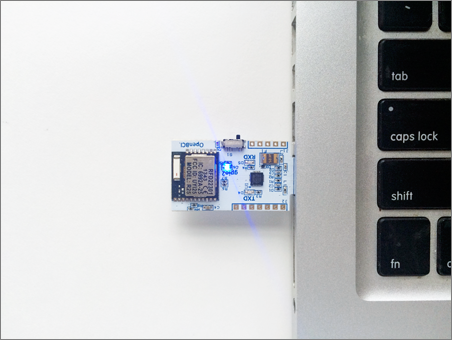

Plug this in (facing upwards!) and you should see a blue LED light up.

**Note:** make sure your USB Dongle is switched to GPIO 6 and not RESET. The switch should be set closer to your computer as seen in the picture to the right.

### 3. Plug in your 6V AA batter pack (with batteries)

Both the 8bit board and the 32 bit boards have specific input voltage ranges. These input voltage ranges can be found on the back-side of the board, next to the power supply. **BE VERY CAREFUL** to not supply your board with voltages above these ranges, or else you will damage your board's power supply. For this reason, we recommend that you always use the battery pack that came with your OpenBCI kit. There's a good reason we put this notice in here twice!

### 4. Switch your OpenBCI board to PC (not OFF or BLE)

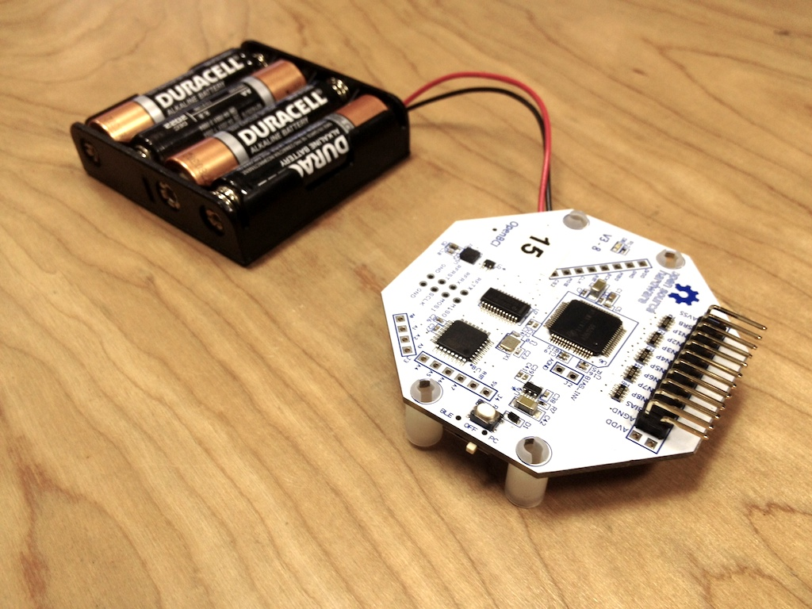

Make sure to move the small switch on the right side of the board from "OFF" to "PC". As soon as you do, you should see a blue LED blink 3 times. You don't press the reset button just to the left of the switch. If the LED still does not blink 3 times, make sure you have full battery. If you're sure your batteries are fully charged, consult the [hardware section](http://openbci.com/index.php/forum#/categories/hardware) of our Forum.

**Note:** it's important to plug in your Dongle before you turn on your OpenBCI board. Sometimes, if the data stream seems broken, you may need to unplug your USB Dongle and power down your OpenBCI board. Make sure to plug your USB Dongle in first, then power up your board afterwards.

## IV. Connect to your OpenBCI board from the GUI

### 1. Relaunch your OpenBCI GUI

You may need to relaunch the OpenBCI GUI after installing the FTDI drivers.

### 2. Select LIVE (from OpenBCI)

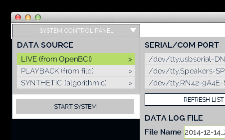

In order to connect to your OpenBCI, you must specify the data source to be "LIVE (from OpenBCI)" in the first section of the SYSTEM CONTROL PANEL. Before hitting the START SYSTEM button, you need to configure your OpenBCI board (follow the steps below).

### 3. Find your USB Dongle's Serial/COM port 

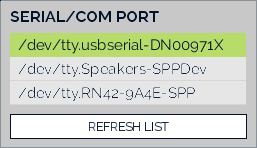

In the first section of the LIVE (from OpenBCI) sub-panel, find your Dongle's Serial/COM port name. If you're using a MAC, it's name will be in the following format:

**/dev/tty.usbserial-DNxxxxxx**

If you're using Windows or Linux, it will appear as:

**COM#**

Your USB Dongle's port name will likely be at the top of the list. If you don't see it:

1. Make sure your dongle is plugged in and switched to GPIO 6 (not RESET)
2. Click the REFRESH LIST button in the SERIAL/COM PORT section of the sub-panel
3. Make sure you've installed the latest FTDI drivers, as described in section III.1

If you're still having trouble finding your USB Dongle's port name, refer to the [Forum](http://openbci.com/index.php/forum#/categories/hardware) about debugging your hardware connection.

### 4.(optional) Edit the Playback file name

In the DATA LOG FIlE section of the LIVE (from OpenBCI) sub-panel you can specify the name of your playback file. This file name is automatically defaulted to:

**SavedData\OpenBCI-RAW- + date/time**

You can edit the the name of this file by clicking in the "File Name" text field.

If you're running the OpenBCI GUI from Processing. This file will be saved at the root of your OpenBCI_GUI directory. 

If you're running the OpenBCI GUI as a standalone application, this file will be saved in /Contents/Java/Data/EEG_Data/

If working from a Mac, you'll need to right-click on the OpenBCI_GUI application and then select "show package contents" to see the /Contents directory where your playback files are saved.

After creating a Playback file, it can be replayed by running the OpenBCI GUI with the Plaback File data source mode. As a result, you can easily share recorded OpenBCI Playback files with your friends and colleagues.

### 5 Select your channel count (8 or 16)

The CHANNEL COUNT setting is defaulted to 8. If you are working with an OpenBCI Daisy Module and 32bit board (16-channel) system, be sure to click the 16 CHANNELS button before starting your system.

### 6. Select your SD setting

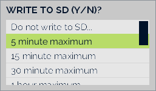

If you want to log data to a MicroSD inserted into the OpenBCI Board, in the WRITE TO SD (Y/N)? sub-panel section you can select the maximum recording time of the file. This setting is defaulted to "Do not write to SD…" and will automatically switch to this if you do not have a MicroSD card properly inserted into your OpenBCI Board.

**Note:** be sure to select a file size that is larger than your planned recording time. The OpenBCI writes to the local SD in a way that enables us to write lots of data very quickly. As a result, however, we must specify how large the file will be before we begin. The technique is known as block writing.

### 7. Press "START SYSTEM"

Now you're ready to start the system! Press the START SYSTEM button and wait for the OpenBCI GUI to establish a connection with your OpenBCI Board. This usually takes ~5 seconds. 

During this time, the help line at the bottom of the OpenBCI GUI should be blinking the words: "Initializing communication w/ your OpenBCI board."

**TROUBLESHOOTING**

If the initialization fails, try the following steps in order:

1. Making sure you've selected the correct serial/COM port
2. Power down your OpenBCI board and unplug your USB Dongle. Then, plug back in your USB Dongle and power up your OpenBCI board in that order. Then try restarting the system, but pressing the START SYSTEM button again.
3. If this does not work, try relaunching the OpenBCI GUI application and redo step 2 above. Then reconfigure the SYSTEM CONTROL PANEL settings, and retry START SYSTEM.
4. Make sure that your batteries are fully charged and then retry the steps above.
5. If you are still having troubles connecting to your OpenBCI board, refer to the [Forum](http://openbci.com/index.php/forum) for extra troubleshooting advice.

### 8. Your OpenBCI is now live!

Once the GUI successfully connects to your OpenBCI Board, click anywhere outside of the SYSTEM CONTROL PANEL to access the rest of the features of the GUI.

You can now press the bright green Start Data Stream button (located at the top middle of the GUI) to begin streaming live data from your OpenBCI board.

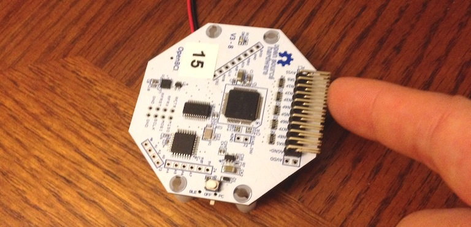

To make sure that it is responsive, (after you've started the data stream) try running your fingers along the electrode pins at the bottom of your board. 

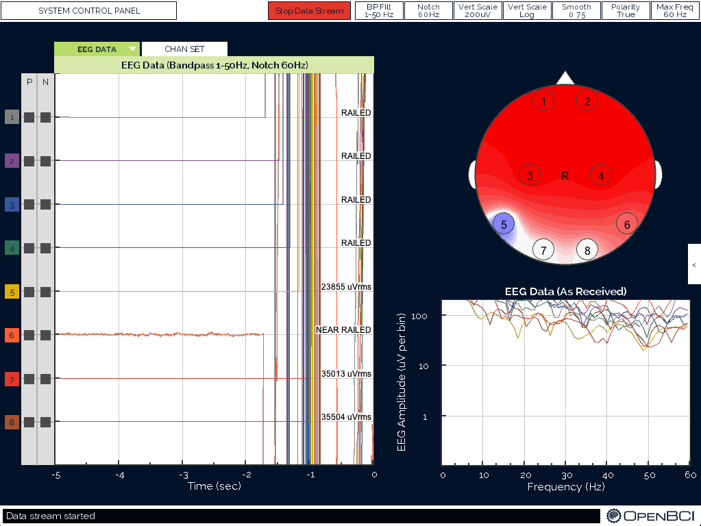

You should see the channels 8-16 channels on the EEG DATA montage behave chaotically in response to you touching the pins. The headplot on the right side of the GUI should become fully saturated (turning bright red) when you do this.

Congratulations, you are now connected to your OpenBCI board. It's time to see some brain waves!

## V. Connect yourself to OpenBCI

### 1. asdf

### 2. asdf

### 3. asdf

### MORE COMING SOON...

# -- CRUDE BELOW THIS POINT --

a. Attach the 4 plastic feet to your OpenBCI board plus some spaghetti

b. Buy 4 AA batteries and put them in your battery pack

c. Connnect the battery pack to the OpenBCI board

d. Connect your electrodes to the OpenBCI board: Black->BIAS; White->SRB; Gray->N1P

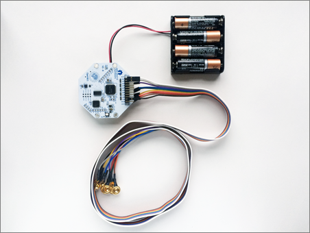

e. Connect the USB Dongle to your computer

### 3. Software Setup

1. Download Processing
2. Download GWOptics and ControlP5 Libraries
3. Unzip the libraries and put them in the /Processing/libraries/ folder.
4. Download the OpenBCI_Processing Github Repository:
`git clone https://github.com/OpenBCI/OpenBCI_Processing.git`

### 4. Headware Setup

1. Apply electrode paste to the 3 electrodes. Make sure to add enough paste so that it forms a convex shape on the electrode cavity, allowing for a strong seal with the skin.
2. Connect 1 ground electrode (typically to the mastoid behind the ear)
3. Connect 1 reference electrode to the earlobe
4. Connect 1 EEG channel electrode (any location on the head from where you want to sample EEG)

### 5. Test It
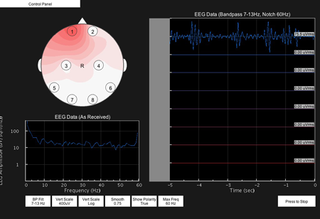

1. Open the file OpenBCI_GUI.pde in Processing and run the program.
2. Select your serial/COM port in the left hand menu and click Initialize System.
3. If for some reason, the brainwaves don't start streaming, switch your OpenBCI board to Off and then back to "PC", and redo the previous step.
4. Click into the main interface and press Tab to change to Channel settings.
5. De-select every channel but the one your EEG channel electrode is connected to, which will be Channel 1 if you connected it to the N1P pin.
6. If all goes as it should, you should see your brainwaves streaming out.
7. Play with the controls to get a feel for different ways to view the data.
8. Blink your eyes, grit your teeth, play around with it!
