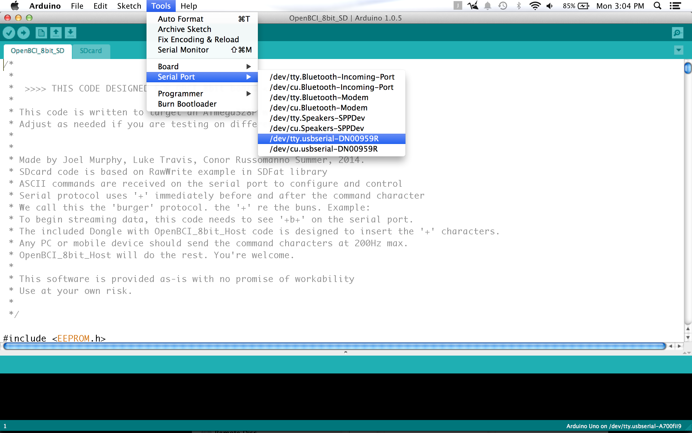

#Upload Code to OpenBCI Board

##Overview
The OpenBCI 8bit and 32bit boards have powerful microcontrollers on them which ship with the latest OpenBCI firmware to interface with the on-board ADS1299, Accelerometer, and SD card. This totorial explains how to program the firmware using the OpenBCI Dongle and you PC. If we come out with a firmware upgrade, or if your or someone comes up with a custom program, you should use the following method for your particular board.

##8bit Upload How-To
**You will need:**

* Computer running Arduino IDE
* OpenBCI Dongle connected to USB port
* OpenBCI 8bit Board with battery power

Make sure that the slide switch on the OpenBCI Dongle is switched to the GPIO6 selection. That way the DTR reset signal will get passed over-air to the ATmega328. If it's on the other side, it will try to program the Dongle-mounted RFduino!  
You can find the latest firmware and libraries on our github repository

https://github.com/OpenBCI/OpenBCI_8bit

You will need to install these files from our repository into your Documents/arduino/libraries folder

* SdFat
	* Supports writing raw data to on-board SD card
* OpenBCI_8
	* The OpenBCI 8bit Library
	
	

Move the file OpenBCI_8bit_SD.ino into your Documents/arduino folder, and start up the Arduino IDE. you should then see the sketch in your Sketch folder.

Select Arduino UNO from the Board drop-down menu.

Select the correct serial port for your OpenBCI Dongle. 

* On Macs, this will be named **/dev/tty.usbserial-DN00nnnn** where the nnnn is a combination of numbers and letters specific to your openBCI Dongle.

* On Windows, the serial port will be listed as a COM port.

* On Linux, it will be different.

When you are happy with the code, simply press upload to program the OpenBCI 8bit target. That's it! You will see some blinky lights on the Dongle, and after a short while, the Arduino IDE will tell you that it's done.

##32bit Upload How-To
**You will need:**

* Computer running latest version of Arduino IDE
* OpenBCI Dongle connected to USB port
* OpenBCI 32bit Board with battery power

Make sure that the slide switch on the OpenBCI Dongle is switched to the GPIO6 selection. If it's on the other side, it will try to program the Dongle-mounted RFduino! 

Next, install the latest version of Arduino IDE which can be found here:

	https://www.arduino.cc/en/Main/Software
	
You can find the latest firmware and libraries on our github repository. 

	https://github.com/OpenBCI/OpenBCI_32bit
	https://github.com/OpenBCI/OpenBCI_32bit_Libraries

* OpenBCI_32bit
	* This is the firmware that runs on the OpenBCI 32bit Board	
* OBCI_SD
	* Supports writing raw data to on-board SD card
* OpenBCI_32_Daisy
	* The OpenBCI 32bit Library

You will need to install the folders 'OpenBCI_32_Daisy' and 'OBCI_SD' from our Libraries repository into your Documents/Arduino/libraries folder. If there is no 'libraries' folder in the sketch folder, create one. Move the folder called 'OpenBCI_32bit' into your Documents/Arduino folder.

Before you can upload code correctly to the PIC32 with Arduino, you need to add the chipKIT-core board files to your Arduino. Follow the instructions to download and install the latest chipKIT-core hardware files from the chipKIT-core wiki

	http://chipkit.net/wiki/index.php?title=ChipKIT_core
	
_______________________

Select OpenBCI 32 from the Board drop-down menu.
___________

Select the correct serial port for your OpenBCI Dongle. 

* On Macs, this will be named **/dev/tty.usbserial-DN00nnnn** where the nnnn is a combination of numbers and letters specific to your openBCI Dongle.

* On Windows, the serial port will be listed as a numbered COM port.

* On Linux, it will be different.

When you are happy with the code, you will have to put the 32bit board into bootloader mode. We don't have a way to remotely reset the chipKIT compatable IC, so you have to do it manually.

* First, press and hold the RST button
* Then press and hold the PROG button	
* Then, release the RST button while still holding the PROG button down
* OK, now you can release the PROG button

Now you should see the blue LED on the 32bit board blinking pleasantly. Press the upload button on the mpide. That's it! You will see some blinky lights on the Dongle, and after a short while, the Arduino IDE will tell you that it's done.
