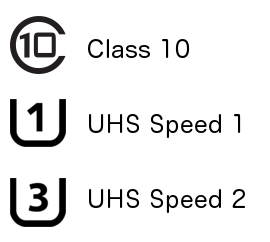
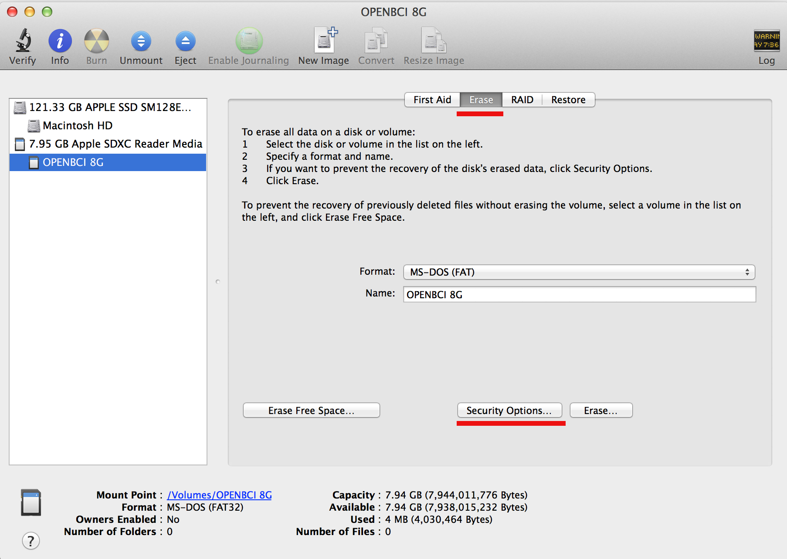
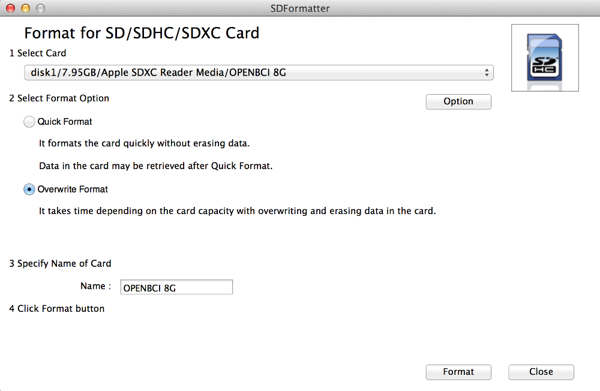

#Using SD Card with OpenBCI

##Overview
There are many situations where logging biometric data to local storage may be desirable. You may be doing a sleep study, or out on the road with your OpenBCI, and the wireless connection to a PC may be tenuous. The amount of data you are producing may require more bandwidth than the BLE connection can handle. This tutorial will cover the basics of adding an SD card for local storage to OpenBCI, how the data is formatted on the card, and how to retrieve the data after you've logged it. 

##SD Card Basics

First thing to know is that low-cost cards and slow speed cards are **not** recommended. When shopping for SD cards, make sure to look for high quality (Scan Disk, eg) and high speed (class 10 minimum). Look for the symbols to the right to know you are getting the right kind of card. You will also want to look for a card that has alot of memory. OpenBCI will generate about 1 mega bye of data when it is recording samples at the default rate of 250Hz. That's alot of data!

We've used these two cards in the OpenBCI lab, and they both work great. 

###Formatting

If you are using a new card, or one that you've had around, first thing you should do is format it. We've found that the most successful formatting method is one that overwrites the card, not just 'erasing' it which can leave old data intact. The Mac OS provides this option in the Disk Utility. Click the Erase tab, open Security Options, and slide the slider to the 'single pass of zeros' option. There are more comprehensive secure erase options, but they take longer. 

Another, and some say better, option is to use the SD Association's own formatter software. [Download it here](https://www.sdcard.org/downloads/formatter_4/). (available for Windows and Mac). We recommend using it if you are on a Windows machine, because the Windows format option does not allow for overwriting the disk. Make sure to select OverWrite Format Type when using the SDFormatter tool on Windows or Mac.

In our experience, it's best not to have any sort of file structure on the SD card. All files that OpenBCI boards create will be saved in the root. 

###Block Writing
In order to write OpenBCI data to the SD card in a timely fasion, we are using a block writing technique in Arduino and chipKIT. Blocks are 512 bytes. That means that OpenBCI will collect bytes as they come in from the sensors, and when a block is complete (512 bytes) it is written to the file on SD card. First, of course, the file needs to be created, and memory on the card allocated. OpenBCI uses ASCII commands to control the creation of a file. The following key commands allocate different amounts of SD card memory
	
    'A': BLOCK_COUNT = BLOCK_5MIN	= 5.6Mb
    'S': BLOCK_COUNT = BLOCK_15MIN	= 17Mb
    'F': BLOCK_COUNT = BLOCK_30MIN	= 34Mb
    'G': BLOCK_COUNT = BLOCK_1HR	= 67Mb
    'H': BLOCK_COUNT = BLOCK_2HR	= 133.5Mb
    'J': BLOCK_COUNT = BLOCK_4HR	= 266.8Mb
    'K': BLOCK_COUNT = BLOCK_12HR	= 800Mb
    'L': BLOCK_COUNT = BLOCK_24HR	= 1.6Gb
    'a': BLOCK_COUNT = 14 seconds	= 262Kb

The OpenBCI Processing sketch allows for selecting recording blocks from 'A' to 'L'. the 'a' allocation is for testing. You can use it if you like.